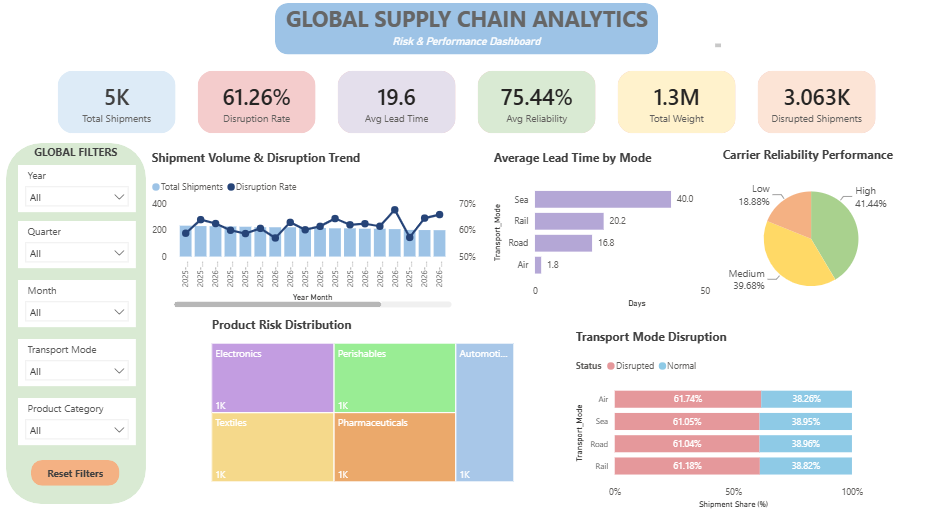

# Supply Chain Risk & Performance Analytics

## Project Overview

This project analyzes global supply chain shipment data to identify operational risks, transportation performance issues, and efficiency improvement opportunities.

The project follows a complete data analytics workflow:

Raw Data → Data Cleaning → Analysis → Dashboard

## Business Objective

The objective of this project is to provide insights into:

- Shipment performance monitoring
- Transportation disruption risks
- Lead time optimization
- Product category risk assessment
- Supply chain reliability evaluation

## Tools & Technologies

- Microsoft Excel
- Power Query
- Pivot Tables
- Power BI (dashboard enhancement)

## Dataset Overview

The dataset contains shipment-level records with information about:

- Shipment details
- Transportation modes
- Product categories
- Delivery performance
- Disruption indicators
- Reliability metrics

Dataset size:

- Records: 5,000 shipments
- Original fields: 14 columns

## Data Preparation Process

Data cleaning and transformation were performed using Power Query.

Key steps:

- Removed duplicate records
- Checked missing values
- Standardized data formats
- Created time-based attributes
- Prepared analytical datasets

## Main Performance Indicators

The project tracks:

| KPI | Description |
| --- | --- |
| Total Shipments | Total shipment volume |
| Disruption Rate | Percentage of disrupted shipments |
| Average Lead Time | Average delivery duration |
| Reliability Score | Supply chain reliability measurement |
| Total Weight | Shipment volume |
| Disrupted Shipments | Number of affected shipments |

## Dashboard Preview

### Executive Dashboard

## Project Structure
